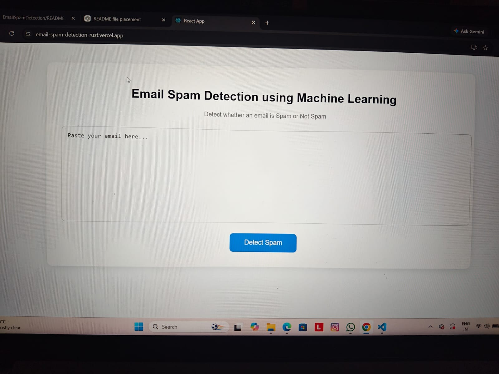
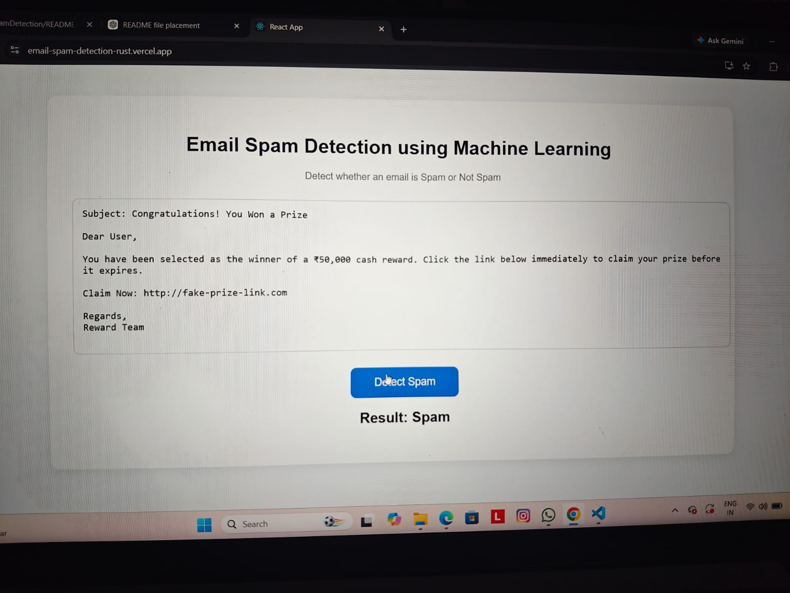
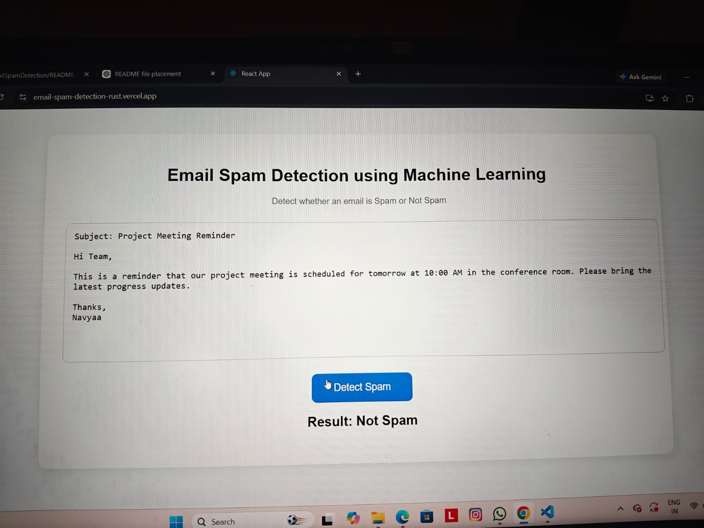

# 📧 Email Spam Detection System

A full-stack Machine Learning web application that classifies email messages as **Spam** or **Not Spam** using **Natural Language Processing (NLP)** and a trained **Scikit-learn** model.

The application combines a **React.js frontend**, **Flask backend**, and a Machine Learning model to provide fast and accurate spam detection.

---

# 🚀 Live Demo

### 🌐 Frontend (Vercel)

**https://email-spam-detection-rust.vercel.app**

### 🔗 Backend API (Render)

**https://emailspamdetection-now6.onrender.com**

---

# ✨ Features

- Detects Spam and Not Spam emails
- Machine Learning-based text classification
- Natural Language Processing (NLP)
- Fast and accurate predictions
- Clean and responsive React interface
- Flask REST API backend
- Fully deployed using Vercel and Render

---

# 🛠️ Tech Stack

## Frontend

- React.js
- HTML5
- CSS3
- JavaScript
- Axios

## Backend

- Python
- Flask
- Flask-CORS

## Machine Learning

- Scikit-learn
- Pandas
- NumPy
- TF-IDF Vectorizer
- Pickle

## Deployment

- Vercel (Frontend)
- Render (Backend)
- GitHub

---

# ⚙️ How It Works

1. User enters an email message.
2. React sends the email text to the Flask backend.
3. The backend preprocesses the text using NLP techniques.
4. TF-IDF Vectorizer converts the text into numerical features.
5. The trained Machine Learning model predicts whether the email is Spam or Not Spam.
6. The prediction is displayed instantly on the screen.

---

# 🧠 Machine Learning Workflow

- Data Collection
- Data Cleaning
- Text Preprocessing
- Feature Extraction (TF-IDF Vectorization)
- Model Training
- Model Evaluation
- Model Saving
- Prediction

---

# 📂 Project Structure

```text
EmailSpamDetection/
│
├── backend/
│   ├── app.py
│   ├── train_model.py
│   ├── predict.py
│   ├── preprocess.py
│   ├── best_model.pkl
│   ├── vectorizer.pkl
│   └── requirements.txt
│
├── frontend/
│   ├── public/
│   ├── src/
│   ├── package.json
│   └── package-lock.json
│
├── dataset/
│   ├── spam.csv
│   ├── cleaned_spam.csv
│   └── email_spam_dataset.csv
│
├── README.md
└── .gitignore
```

---

# ⚙️ Installation

## Clone the Repository

```bash
git clone https://github.com/Navyaasharma704/EmailSpamDetection.git
cd EmailSpamDetection
```

## Backend Setup

```bash
cd backend
pip install -r requirements.txt
python app.py
```

## Frontend Setup

Open a new terminal.

```bash
cd frontend
npm install
npm start
```

---

# 💻 Live Application

Instead of running the project locally, you can directly use the deployed application.

### 🌐 Frontend

https://email-spam-detection-rust.vercel.app

### 🔗 Backend API

https://emailspamdetection-now6.onrender.com

---

## 📸 Screenshots

### 🏠 Home Page



### 🚫 Spam Prediction



### ✅ Not Spam Prediction


---

# 🚀 Future Improvements

- Gmail API Integration
- User Authentication
- Spam Detection History
- Multi-language Spam Detection
- Deep Learning Model
- Improved Prediction Accuracy

---

# 👩‍💻 Developer

**Navyaa Sharma**

B.Tech Information Technology Student

Passionate about Data Science, Machine Learning, Artificial Intelligence, and Full-Stack Development.

### GitHub

https://github.com/Navyaasharma704

### LinkedIn

https://www.linkedin.com/in/navyaa-sharma-37b668327/

---

# ⭐ Support

If you found this project useful, please consider giving it a ⭐ on GitHub.

Thank you for visiting this repository!